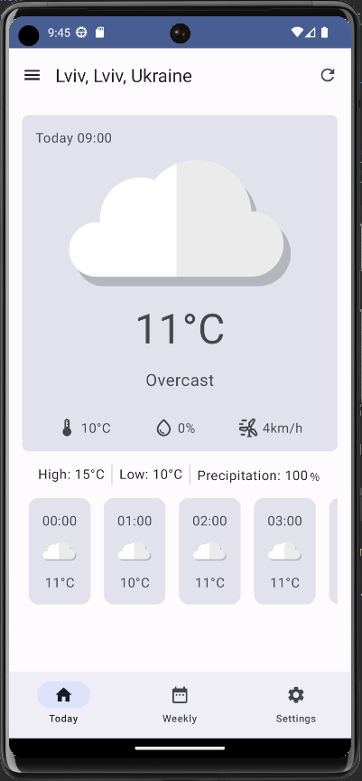
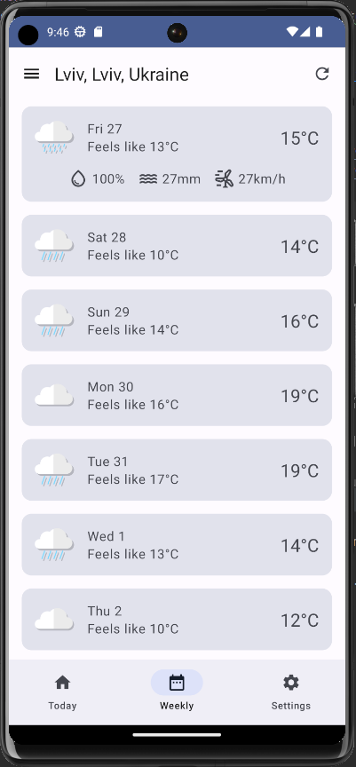
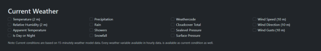
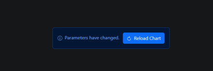
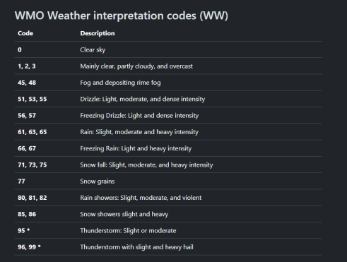
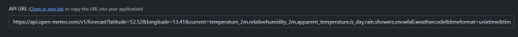

# Weather App Implementation

## Project Description
Implement an Android Weather App that provides real-time weather information for specific locations. The app should show weather data based on user location, display current weather conditions, including temperature and weather description, and provide a 7-day weather forecast. The app should also support offline access to cached data.

## Technologies and Tools
- Android Studio
- Kotlin
- Retrofit for network requests
- Open-Meteo API for weather data
- Coroutines for asynchronous operations
- Room for local data storage
- LiveData/Flow for real-time UI updates
- WorkManager for background task scheduling

## Project Duration
5-6 business days

## Project Milestones and Deadlines
- **Day 1-2: Project Setup and UI Design**
    - Download and install [Android Studio](https://developer.android.com/studio)
    - Set up the Android project in Android Studio.
    - Design the user interface (UI)
    - Implement the UI design using Layouts in your project
- **Day 2-3: Network Requests, API Integration and Location request**
    - Implement Retrofit for making network requests.
    - Implement getting user`s last known location for weather requests
    - Create an interface for fetching weather data from the Open-Meteo API.
    - Integrate Coroutines for handling asynchronous network requests.
    - Use LiveData for real-time UI updates with both current weather and the 7-day weather forecast.
- **Day 4-5: Data Storage and Caching**
    - Implement Room for local data storage.
    - Cache both current weather and the 7-day weather forecast to support offline access.
- **Day 5-6: Background Tasks**
    - Use WorkManager to schedule background tasks

## App Design
The app should have the following key design elements:

- **Navigation**: Create a user-friendly navigation system that allows users to seamlessly switch between the current weather view and the 7-day weather forecast.

- **Current Weather**: Design a clear and engaging interface for displaying current weather data, with at least three relevant weather parameters(Temperature, max temperature, min temperature, rain, humidity, etc.). This interface should also include hourly weather information for the current day.

- **Seven-Day Weather Forecast**: Create a visually appealing interface to present a list of a 7-day weather forecast. Same as with current weather screen, it should display some relevant weather data for each day.

- **Optional Feature**: Location-Based Weather Search. If implemented, the app should enable users to search for weather information by location.

**Here is an example of how similar app can look**

Current weather screen, don't pay attention to the settings tab or other functionality that is not described above



An example of daily weather forecast screen. In this example daily weather details expand on click, as seen on the image, but such functionality is optional for your app.



Use the UI of this app as a reference for your own, customize and change it as you see fit for your app.

## Project Deliverables
- A functional Android Weather App for real-time weather data updates.
- Display of both current weather and a 7-day weather forecast.
- Offline access to cached weather information.
- Automatic background updates of weather data, and/or user notifications

## How to Use an API
Here is the official documentation of the free, non-commercial weather API: [Open-Meteo API Documentation](https://open-meteo.com/en/docs). It provides a list of available weather parameters for current, hourly, and daily weather.



To generate an API URL, pick the parameters needed in the app, and the link will appear below in the API URL field (Click on Reload Chart to regenerate the link).



To implement weather coding, use this list from the documentation.



**Important:**
Longitude and latitude of a location are required fields for this weather API call, as well as timezone (You can use `timezone=auto`). Also, recommend using `timeformat=unixtime` for future timestamp parsing.

To implement optional weather search by city, you can use the [Geocoding API](https://open-meteo.com/en/docs/geocoding-api) to get location coordinates.

### Example of API call:
Example of API URL:



### Example of JSON response:
```json
{
  "latitude": 52.52,
  "longitude": 13.419998,
  "generationtime_ms": 0.35500526428222656,
  "utc_offset_seconds": 7200,
  "timezone": "Europe/Berlin",
  "timezone_abbreviation": "CEST",
  "elevation": 38.0,
  "current_units": {
    "time": "unixtime",
    "interval": "seconds",
    "temperature_2m": "°C",
    "relativehumidity_2m": "%",
    "apparent_temperature": "°C",
    "is_day": "",
    "rain": "mm",
    "showers": "mm",
    "snowfall": "cm",
    "weathercode": "wmo code"
  },
  "current": {
    "time": 1698062400,
    "interval": 900,
    "temperature_2m": 14.4,
    "relativehumidity_2m": 72,
    "apparent_temperature": 13.3,
    "is_day": 1,
    "rain": 0.00,
    "showers": 0.00,
    "snowfall": 0.00,
    "weathercode": 2
  }
}
